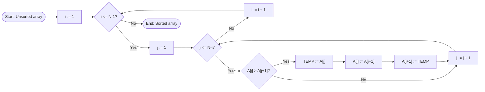
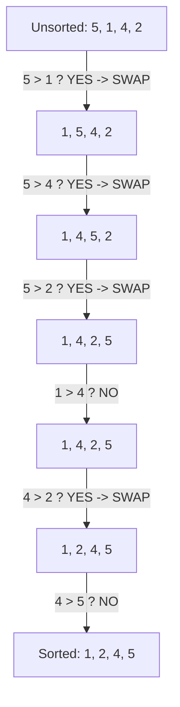

# Algoritmusok - Algorithms

## 1. Buborékos rendezés - Bubble sort 

| HU | EN |
| ----------- | ----------- |
| A buborékos rendezés a sorozat elemeit növekvő sorrendbe rendezi a szomszédos elemek összehasonlításával. | Bubble sort arranges the elements of an array by comparing adjacent elements. |

#

###

###
```
Bemenet:	A[1..N]  rendezetlen tömb
Kimenet:	A[1..N]  rendezett tömb
Algoritmus:
    Ciklus i := 1 től N-1 -ig
        Ciklus j := 1 től N-i -ig
            Ha (A[j] > A[j+1]) akkor
                SEGED := A[j]
                A[j] := A[j+1]
                A[j+1] := SEGED
            Elágazás vége
        Ciklus vége
    Ciklus vége
Algoritmus vége

```
```
Input:   A[1..N] (unsorted array)
Output:  A[1..N] (sorted array)
Algorithm:
    Loop i := 1 to N-1
        Loop j := 1 to N-i
            If (A[j] > A[j+1]) then
                TEMP := A[j]
                A[j] := A[j+1]
                A[j+1] := TEMP
            End if
        End loop
    End loop
End algorithm
```
### Megvalósítás - Implementation
| HU | EN |
| ----------- | ----------- |
| Egy postás egy utcában 5 levelet kézbesít. A leveleket összekeverve kapta meg, ezért szeretné sorba rendezni házszámok alapján, hogy a kézbesítés során a lehető legkevesebbet kelljen visszafordulnia. | A postman delivers 5 letters on a street. He received the letters mixed up, so he wants to sort them out by house number so that he has to turn around as little as possible during the delivery. |

### Megoldás - Solution
- i (külső) ciklus végigmegy a tömbön többször.
Minden külső ciklus végére a legnagyobb elem a tömb végére kerül.
- j (belső) ciklus az aktuálisan még rendezetlen részen megy végig, és mindig két szomszédos elemet hasonlít össze.
- Ha house[j] > house[j+1], akkor a két elem helyet cserél:
- house[j] értékét elmentjük egy segédváltozóba
- house[j] helyére A[j+1] kerül
- house[j+1] helyére a segédváltozóban tárolt érték kerül
- A ciklusok addig ismétlődnek, amíg a tömb minden eleme a megfelelő sorrendbe nem kerül.
---
- i (outer) loop iterates over the array multiple times.
After each outer loop, the largest unsorted element is moved to the end of the array.
- j (inner) loop goes through the currently unsorted part of the array and always compares two adjacent elements.
- If house[j] > house[j+1], then the two elements are swapped:
- The value of house[j] is stored in a temporary variable:
- house[j] is replaced with house[j+1]
- house[j+1] is replaced with the value stored in the temporary variable
- The loops repeat until all elements of the array are in the correct order.

### C++
```
#include <iostream>
using namespace std;

int main() {
    int house[5] = { 12, 5, 23, 8, 1 };
    int N = 5;

    cout << "Unsorted: ";
    for (int i = 0; i < N; i++) {
        cout << house[i] << " ";
    }
    cout << endl;

    for (int i = 0; i < N - 1; i++) {
        for (int j = 0; j < N - i - 1; j++) {
            if (house[j] > house[j + 1]) {
                int temp = house[j];
                house[j] = house[j + 1];
                house[j + 1] = temp;
            }
        }
    }

    cout << "Sorted: ";
    for (int i = 0; i < N; i++) {
        cout << house[i] << " ";
    }
    cout << endl;

    return 0;
}
```
### C#
```
using System;

class Program
{
    static void Main()
    {
        int[] house = { 12, 5, 23, 8, 1 };
        int N = house.Length;

       
        Console.Write("Unsorted: ");
        for (int i = 0; i < N; i++)
        {
            Console.Write(house[i] + " ");
        }
        Console.WriteLine();

        for (int i = 0; i < N - 1; i++)
        {
            for (int j = 0; j < N - i - 1; j++)
            {
                if (house[j] > house[j + 1])
                {
                    int temp = house[j];
                    house[j] = house[j + 1];
                    house[j + 1] = temp;
                }
            }
        }

        Console.Write("Sorted: ");
        for (int i = 0; i < N; i++)
        {
            Console.Write(house[i] + " ");
        }
        Console.WriteLine();
    }
}

```
### Python
```
house = [12, 5, 23, 8, 1]
N = len(house)

print("Unsorted:", house)

for i in range(N - 1):
    for j in range(N - i - 1):
        if house[j] > house[j + 1]:
            temp = house[j]
            house[j] = house[j + 1]
            house[j + 1] = temp

print("Sorted:", house)
```
### Time Complexity
| HU | EN |
| ----------- | ----------- |
| Az időbonyolultság egy algoritmus futtatásához szükséges műveletek száma| Time complexity is the number of operations needed to run an algorithm |
| n elemű tömbben n összehasonlítás történik egy ciklusban | In an array of n elements, n comparisons are made in one cycle. |
| A ciklus n alkalommal ismétlődik -> n * n  | The cycle repeats n times -> n * n|
| O: az algoritmus időbonyolultsága a legrosszabb esetben|O: means worst case time complexity for an algorithm|

O(n<sup>2</sup>)
```mermaid
xychart-beta
    title "O(n^2) Time Complexity"
    x-axis "n" 0 --> 10
    y-axis "Time" 0 --> 100
    line "O(n^2)" [0,1,4,9,16,25,36,49,64,81,100]
```   